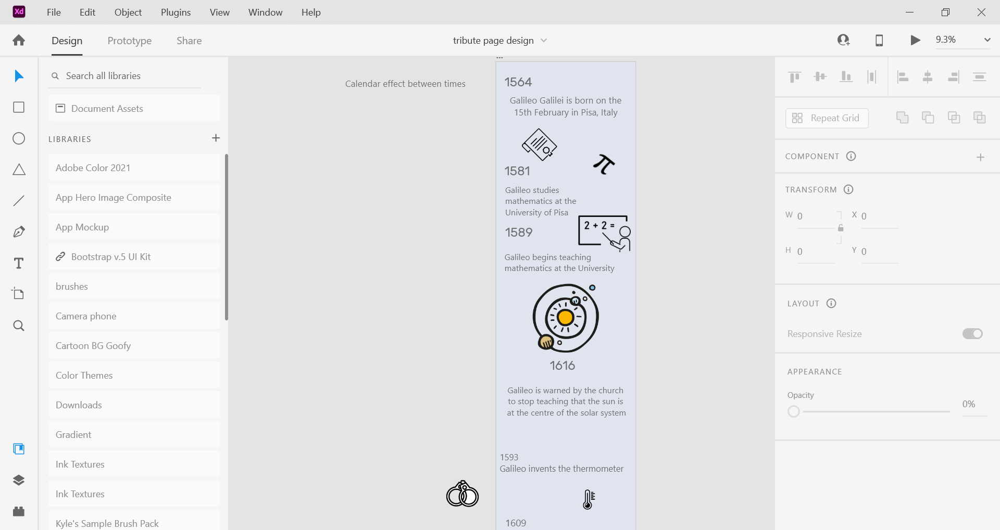

# tribute-page
project1-freecodecamp-tributepage
Thank you for checking out my project. This was first completed as part of Responsive Web Design course at FreeCodeCamp
 
Since completing this small project and beginning a FCC course in Javascript Datastructures & Algorithms, I came to the conclusion that, in order to get into the industry I would need some well styled, modern websites to hold any kind of attention that I may get. THerefore, I returned to this basic project with a thought to add some graphics and movement to take this up a few levels. 

# Firstly I used Adobe Illustrator to draw some of the icons I would be using. I really liked some of the icons I found as reference so to save time, I used some of those too. Reference list below and code will reflect this. 

***REFERENCE LIST:***
[No Date] No Name [online] available at: https://www.theschoolrun.com/homework-help/galileo-galilei [Accesed on: 29,09.21]

